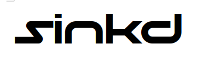

# 

_**Everything and the kitchen sink**_  

## Deployable Cloud

_True Privacy_  
I believe your files should stay with you **always**.  

- **No** third party eyes
- **No** privacy policies
- **No** tradeoffs

Given the pleathora of cloud providers and the frequent data breaches of large companies 
I created `sinkd` to give the power back to the user. With an old machine, or a spare 
Raspberry Pi, you can create your own __local__ cloud! The purpose and goal of this program
is to get out of the users way while reducing the overhead of keeping up environments 
across many computers. 

1. Cross-Platform (*nix, Windows(WSL)), built for ARM and x86
1. Wraps `rsync` into a daemon keeping track of file events
1. Physical access to your files
1. Granular permissions per user  

### Roadmap

- use `btrfs` on a virtual mount for ease of snapshotting
- add encryption to files watched by sinkd
- access from outside the LAN firewall
- use `git-lfs` to enable data restore (manual tagging)